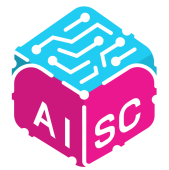

# Telecommunications Technology Engineering & Computer Science

> Telecommunications Technology Engineering @ **UC3M** (2021–2026) · Exchange @ **UCR** (2024–2025) · AI engineering & Computer Science & Electrical Engineering

## 🧭 Table of Contents
- 👨‍💻 [Projects](#projects)
- 💼 [Professional Experience](#professional-experience)
- 🎓 [Education](#education)
- 💻 [Technical Skills](#technical-skills)
- 🌐 [Languages](#languages)
- 💡 [Soft Skills](#soft-skills)

---

## 👨‍💻 Projects
    **[AISC@Riverside Competitive Project - AI Interview Assistant](https://github.com/alfonsomayoral/AISC_Competitive_Project_Web)**

🏆 **[UCR Hackathon 3rd place Project - Bad Posture Detection System using AI and Computer Vision](https://github.com/alfonsomayoral/BearHack_Project/tree/main)**

🤖 **[Embedded Systems-Based Mobile Robot Using STM32L-Discovery](https://github.com/alfonsomayoral/Embedded-Systems-Based-Mobile-Robot-Using-STM32L-Discovery)**

🎨 **[Image Color Quantization Using K-means Clustering and PCA](https://github.com/alfonsomayoral/ImageColorQuantization_PythonProject)**

🔍 **[Optimized IP Route Lookup Using Compressed Binary Trees](https://github.com/alfonsomayoral/Optimized-IP-Route-Lookup-Using-Compressed-Binary-Trees)**

🔢 **[MNIST Handwritten Digits Classification Using Multi-Layer Neural Network](https://github.com/alfonsomayoral/MNIST-Handwritten-Digit-Classification-Using-a-Multi-Layer-Neural-Network)**

---

## 💼 Profesional Experience
### **Suntory Global Spirits** | *AI Engineer Jr* *(Sep 2025 – Present, incoming)*
- Design and delivery of effective AI solutions and process automations across internal workflows.
- Build PoCs and production-ready tools focused on measurable impact and efficiency.

### **Telefonica Business Solutions |  Talentum Scholarship Holder (_Jun 2022 - Aug 2022_)**
- Selected to participate in practical training periods in software development as an intern in the workplaces of companies of the Telefónica Group under the supervision of tutors.
- Gaining insights into Telefónica through case studies and seminars. Listened to 10+ lectures by professionals and solved 2 real-world case problems.
- Participation in +8 professional team-building workshops on topics related to data analysis, artificial intelligence, and software development

### **AISC Madrid (UC3M)** | *Vice President & Co-founder* *(Jul 2025 – Present)*
- Co-founded the **first AISC chapter in Europe** and the **first AI student association at UC3M**.
- Mission pillars:
  -  Develop practical, in-demand AI skills among students.
  -  Bridge academia and industry through talks, mentorship, and events.
  -  Build an active, collaborative community around AI.

### **AISC Riverside** | *Competitive Projects Team Member* *(Sep 2024 – Jun 2025)*
- Directed **3 workshops** for **30+** participants on AI, machine learning, NLP, and computer vision.
- Member of the competitive AI team developing **real-time video-call interview sentiment analysis** software.
- Drove tech-literacy initiatives, actionable events, and education programs for all students.
- Strengthened teamwork and communication through cross-functional collaborations on AI projects.

---

## 🎓 Education
### **Higher Polytechnic School of the Carlos III University of Madrid, Spain** | *Sep. 2021 - Jun 2026*
#### [Bachelor in Telecommunications Technology Engineering, 4º Year_](https://www.uc3m.es/bachelor-degree/telecommunication)
- **Actual GPA:** 3.5 / 4.0 (_only taking into account the grades from 1st to 3rd_)
- **Relevant Coursework:**
   - ⚡ **_Electronics and Hardware Design:_**
     - [Electronic components and circuits](https://aplicaciones.uc3m.es/cpa/generaFicha?est=252&anio=2024&plan=445&asig=15374&idioma=2)
     - [Electronic Systems](https://aplicaciones.uc3m.es/cpa/generaFicha?est=252&plan=445&asig=15383&idioma=2)
     - [Microprocessor based digital systems](https://aplicaciones.uc3m.es/cpa/generaFicha?est=252&plan=445&asig=15380&idioma=2)
     - [Integrated circuits and microelectronic](https://aplicaciones.uc3m.es/cpa/generaFicha?est=252&plan=445&asig=15389&idioma=2)
     - [High frequency technology](https://aplicaciones.uc3m.es/cpa/generaFicha?est=252&plan=445&asig=15387&idioma=2)
   - 🖥️ **_Software Design:_**
     - [Systems Programming](https://aplicaciones.uc3m.es/cpa/generaFicha?est=252&plan=445&asig=15370&idioma=2)
     - [Systems Architecture](https://aplicaciones.uc3m.es/cpa/generaFicha?est=252&plan=445&asig=15376&idioma=2)
     - [Switching](https://aplicaciones.uc3m.es/cpa/generaFicha?est=252&plan=445&asig=15390&idioma=2)
   - 🛰️ **_Telecommunications and Networking:_**
     - [Communication Theory](https://aplicaciones.uc3m.es/cpa/generaFicha?est=252&plan=445&asig=15381&idioma=2)
     - [Communications networks and services](https://aplicaciones.uc3m.es/cpa/generaFicha?est=252&plan=445&asig=15379&idioma=2)
     - [Digital Communications](https://aplicaciones.uc3m.es/cpa/generaFicha?est=252&plan=445&asig=15385&idioma=2)
     - [Access networks and shared media](https://aplicaciones.uc3m.es/cpa/generaFicha?est=252&plan=445&asig=15375&idioma=2)
     - [Modern theory of detection and estimation](https://aplicaciones.uc3m.es/cpa/generaFicha?est=252&plan=445&asig=15938&idioma=2)
     - [Telematic Applications](https://aplicaciones.uc3m.es/cpa/generaFicha?est=252&plan=445&asig=16101&idioma=2)
  
### **University of California, Riverside - Bourns College of Engineering & School of Business** | *Sep 2024 - Jun 2025*
#### _Exchage Year, [Computer Science](https://www1.cs.ucr.edu/programs/undergraduate/computer-science) & [Electrical Engineering](https://www.ece.ucr.edu/undergraduate-program) & [Business](https://business.ucr.edu/undergraduate/major)_
-  **Actual GPA:** 4.0 / 4.0
-  **Relevant Graduate Coursework:**
    - [Principles of Engineering Management](https://msol.ucr.edu/courses/engr203)
    - [Natural Language Processing](https://www.coursicle.com/ucr/courses/CS/222/)
    - [Cryptography](https://www.coursicle.com/ucr/courses/CS/216/)
-  **Relevant Undergraduate Coursework:**
    -  [Machine Learning & Data Mining](https://www.coursicle.com/ucr/courses/CS/171/)
    -  [Computer Vision](https://www.coursicle.com/ucr/courses/EE/146/)
    -  [Artificial Intelligence](https://www.coursicle.com/ucr/courses/CS/170/)
    -  [Mobile Wireless Networks](https://www.coursicle.com/ucr/courses/CS/169/)
    -  [Data Analysis Methods](https://www.coursicle.com/ucr/courses/CS/105/)
    -  [Project Planning and Control](https://www.coursicle.com/ucr/courses/BUS/128/)
    -  [Bussiness Data Communications](https://www.coursicle.com/ucr/courses/BUS/175/)

---

## 💻 Technical Skills
**Programming Languages**:
   - **Python** (Proficient)
   - **C** (Proficient)
   - **VHDL** (Proficient)
   - **Java** (Competent)
   - **TypeScript** (Competent)
   - **C++** (Competent)
   - **MATLAB** (Competent)
   - **HTML** (Basic)
   - **Excel-VisualBasic** (Basic)
   - **SQL** (Basic)

**Tools**: Visual Studio Code, CUDA, Git, Valgrind, GDB, Jupyter, Eclipse, IntelliJ IDEA, MATLAB IDE, Simulink

**Libraries**: PyTorch, Keras, scikit-learn, NLKT, Trasformers, openCV, NumPy, Numpy, Flask, Matplotlib/Seaborn, OpenSSL, Standard C, GLib, libcurl, JDK, JUnit.

---

## 🌐 Languages 
- **Spanish** - Native
- **English** - Fluent - B2 Certificate

## 💡 Soft Skills
- Leadership, Teamwork, Organization, Planning, Public Speaking, Presenting, Creativity, Initiative and Scheduling.

